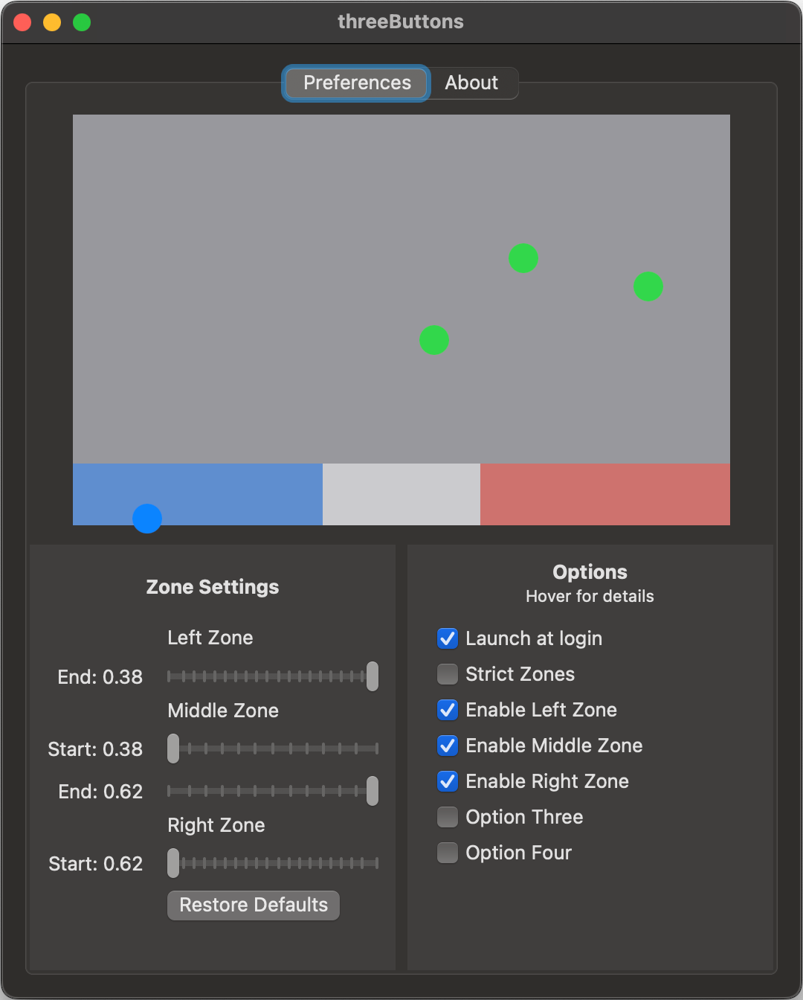
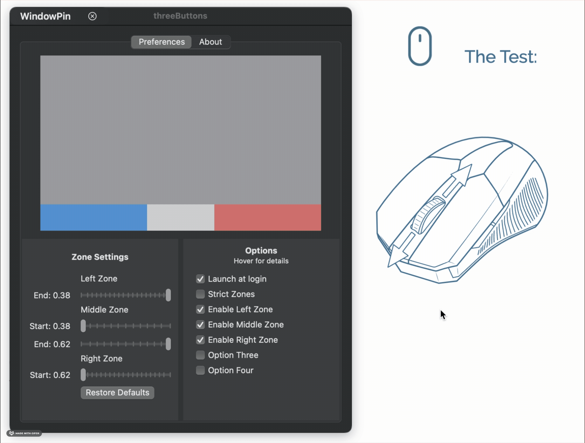

# Welcome to ThreeButtons!

ThreeButtons is meant to emulate the three physical buttons that you’d find on something like a thinkpad(left, middle, right) in macOS. Why? For me, to make it easier to use Fusion360 with a trackpad when I forget a mouse.
<table class="tg">
  <tr>
    <td class="tg-0pky" colspan="2" rowspan="2"></td>
    <td class="tg-0pky" colspan="3" rowspan="4"></td>
  </tr>
</table>
</p>

### Features:
- ✅ Menu Bar item
- ✅ Three distinct zones on the bottom of the trackpad for left, middle, and right click
- ✅ Dragging while clicking
- ✅ Preview area
- ✅ Launch at login
- ✅ Disable/enable click recognition outside of zone ('Strict Zones')
- ✅ Enable/disable certain zones (for example, to just have a large right-click zone)
- ✅ Resizable zones
- ✅ Proper preferences window

### Known issues:
- 🚧 Power usage spikes after opening preferences window. Temporary Fix: Open preferences window, change settings, quit/re-open app. Real fix incoming.
- Dragging from one zone into another and releasing does not release original click
- Fusion360/CAD bug where pan/orbit tools are choppy until all zones are clicked once.
- Touching a zone while you've clicked elsewhere (and then releasing that other click) may cause that key to get stuck
    - Should be fixable by ignoring clicks in zones if a click already exists elsewhere/**making sure to release one type of click before starting another**

🚧 = in progress

### Planned Features:
- Enable/disable two-finger right click overriding zone presence (if you two-finger right-click in any zone, toggle it counting as a right-click or being overridden by the zones)
- Program inclusion/exclusion list
- Fix known issues


# Installation
Download a binary from https://github.com/skylatian/threebuttons/releases (coming soon)
Note: I do not have an apple developer account, so the package will be unsigned and you'll have to override the system warning in Preferences -> Privacy and Security

Or, follow steps to build below.

---


### Building & Development
Clone the repo: `git clone https://github.com/skylatian/threebuttons.git --recurse-submodules`

Cpen `threebuttons/OpenMultitouchSupport/Framework/OpenMultitouchSupportXCF.xcodeproj`

Double click on **OpenMultitouchSupportXCF** at the top right, and go to *Signing & Capabilities*

- Change **Team** to your default team
- Change **Signing Certificate** to *Sign to Run Locally*
- Either click the run button in the top left, or do  `cd theebuttons/OpenMultitouchSupport-main && sh build_framework.sh`
    - if you ran the command, you should see the following (or something similar):
        
        ```bash
        **** BUILD SUCCEEDED ****
        xcframework successfully written out to: [some path]
        ```
Now, open the threebuttons.xcodeproj in xcode

Double click on **threebuttons** at the top right, and go to *Signing & Capabilities*

- Change **Team** to your default team
- Change **Signing Certificate** to *Sign to Run Locally*

Click build! This should run without issue. If not, I’m not sure what happened. Google around, or open an issue if you can’t quite figure it out and I’ll see what I can do.
